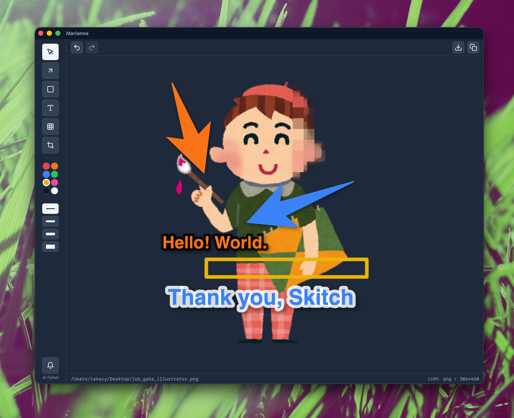

# Marianne

**English** | [日本語](./README_ja.md)

> Skitch-style offline image annotation app (for Apple Silicon)

<div align="center">
  
</div>

## Why build yet another image annotation app?

- 😭 **Skitch is going away**: I have been a long-time Skitch (by Evernote) user — launching it many times a day to slap arrows and text onto images. But Skitch is no longer actively maintained and ships only as an Intel-only build. When [macOS started phasing out Intel support](https://developer.apple.com/documentation/apple-silicon/about-the-rosetta-translation-environment/) and the warning popped up that Skitch would soon stop working, I decided to build an Apple Silicon-native successor that carries Skitch's spirit forward.
- ✂️ **A minimal feature set**: There are many great Skitch alternatives, but for my workflow they all do too much. Arrows, text, and the occasional mosaic on a screenshot is all I really need.
- 🏹 **The arrow shape**: I love the shape of Skitch's arrows. I could not find any annotation app that draws that exact arrow — or text in that familiar style — so I built one myself.

### About the name

The real name of "[Ms. Goldenweek](https://one-piece.com/character/Ms_Goldenweek/index.html)", a painter 🎨🪣🖌️ character from my favorite manga ONE PIECE.

## Design philosophy

- 🔌 **Offline**: no login, no telemetry, no cloud sync, no external server calls (update check only).
- 🪶 **Simple**: arrows, rectangles, text, mosaic, and a bit of cropping — that's the whole toolbox.
- ⚡ **Small and fast**: built on [Tauri](https://v2.tauri.app/), the app is under 20MB and launches in a flash.
- 👤 **No AI**: no AI features. This is for me (a human) to put arrows on images.

## Screenshots

<div align="center">
  
</div>

## Install

> [!NOTE]
> Haven't paid the Apple tax ($99/year), so first launch shows a Gatekeeper warning.
> Approve it from **System Settings → Privacy & Security**, or run the following once in a terminal:
>
> ```bash
> xattr -dr com.apple.quarantine /Applications/Marianne.app
> ```

### From release

> [!NOTE]
> Apple Silicon Macs only.

1. Download the latest `Marianne_<version>_aarch64.dmg` from [Releases](https://github.com/takecy/marianne/releases).
2. Mount the dmg and drag `Marianne.app` into `/Applications`.
3. On first launch, if Gatekeeper warns about the app, approve it from **System Settings → Privacy & Security**. Alternative: run the following once in a terminal.

```bash
xattr -dr com.apple.quarantine /Applications/Marianne.app
```

### From source

1. Make sure the following are installed (matches the official Tauri v2 macOS prerequisites):
   - Xcode Command Line Tools: `xcode-select --install`
   - Rust: [official site](https://www.rust-lang.org/tools/install)
   - pnpm: [official site](https://pnpm.io/installation)
1. Clone this repository
1. Install dependencies with `pnpm install --frozen-lockfile`
1. Install into `/Applications/Marianne.app` with `pnpm install:local:unsigned`
1. On first launch, if Gatekeeper warns about the app, approve it from **System Settings → Privacy & Security**. Alternative: run the following once in a terminal.

```bash
xattr -dr com.apple.quarantine /Applications/Marianne.app
```

> [!NOTE]
> Auto-update is disabled in this build. To upgrade, run `git pull && pnpm install:local:unsigned` again.

## Documentation

- **For users**: [Marianne docs](https://takecy.github.io/marianne/) — features, keyboard shortcuts, image input paths, export options
- **For contributors**: [Getting started](https://takecy.github.io/marianne/getting-started/) — tech stack, dev environment, verification commands, worktree workflow
- **For maintainers**: [Releasing](https://takecy.github.io/marianne/releasing/) — release workflow, signing keys, GitHub Secrets

## License

[PolyForm Noncommercial 1.0.0](./LICENSE)

Personal and noncommercial use is permitted. Use in proprietary products and resale are not.\
This project is not affiliated with or endorsed by Plasq, Evernote, Shueisha, or Eiichiro Oda. "Skitch" and "ONE PIECE" are trademarks of their respective owners.
