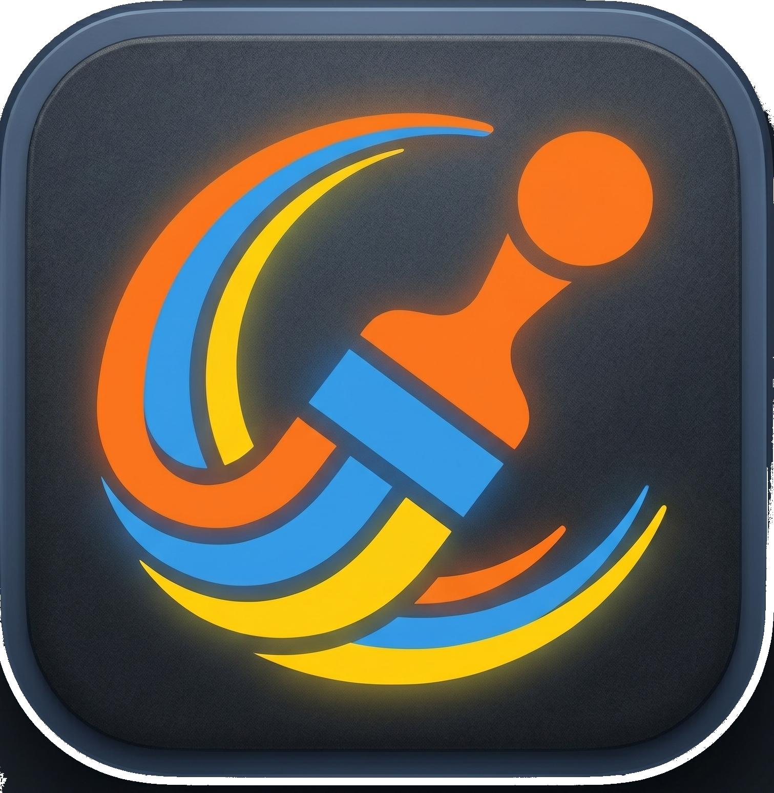

# Marianne

[English](./README.md) | **日本語**

> Skitch 風オフライン画像アノテーション (macOS 専用)。機密情報を含むスクリーンショット向け。

## なぜ Marianne なのか

- **Skitch へのトリビュート**: Marianne は長年 Skitch (Plasq → Evernote) を愛用してきた作者によるリプレイス。Mac 版 Skitch はすでにアクティブ開発が止まり、今はメンテナンスされていない legacy Intel-only バイナリ。macOS から Intel サポートが消える将来を見越し、Skitch の精神を継ぐ作り直しとして 2026 年に作成。[トリビュートの全文 →](https://takecy.github.io/marianne/ja/tribute/)
- **プライバシー第一**: 注釈もスクリーンショットも端末外に出ない。外部通信は GitHub Releases へのアップデートチェックのみ — 起動時に 1 回、ツールバーの「Check for updates」を押した時にもう 1 回。
- **モザイクによる視覚的 redaction**: モザイクブロックはエクスポート時に PNG にラスタライズされ、エクスポートされたファイルから下のピクセルを復元することはできない。スクリーンショットの一部を視覚的に隠す用途に最適 — ただしパスワードや完全なトークンなどハイリスクな機密情報には、別途ピクセルを単色で塗りつぶす事前ツールの併用を推奨する。

### 名前「Marianne」について

漫画『ONE PIECE』(尾田栄一郎・集英社) に登場する画家キャラ「ミス・ゴールデンウィーク」の本名 Marianne から命名 — 画家の名前を画像注釈アプリにつけた。詳細は[トリビュートページ](https://takecy.github.io/marianne/ja/tribute/)へ。

## 設計思想

- **完全オフライン**: テレメトリ・クラウド同期・外部サーバー通信なし (updater が GitHub Releases へ問い合わせる以外)。
- **依存を最小に**: npm パッケージよりもプラットフォーム機能を優先する。ブラウザ / Node / Konva で済む場合は依存を増やさない。
- **Skitch のようにシンプル**: 4 ツール / 8 色 / 4 段階の太さ。固定された小さな表面を、何でも入った巨大なツールバーよりも好む。
- **AI エージェント親和性の高いスタック**: TypeScript + React + Konva の組み合わせは、コーディングエージェント (Cursor / Claude Code 等) が精度の高いコードを生成しやすい。

## スクリーンショット

_アニメーション GIF のデモは将来のリリースで追加予定。_

## クイックインストール

**Apple Silicon Mac 専用** (M1 / M2 / M3、macOS 11+)。

1. [Releases](https://github.com/takecy/marianne/releases) から最新の `Marianne_<version>_aarch64.dmg` をダウンロード。
2. dmg をマウントし、`Marianne.app` を `/Applications` フォルダにドラッグ。
3. 初回起動時、Gatekeeper の警告が出たらアプリを右クリック →「開く」で承認する (本ビルドはコード署名なし)。または `xattr -dr com.apple.quarantine /Applications/Marianne.app` をターミナルで一度実行する。

インストール後、スクリーンショットをペースト (`Cmd + V`) するかウィンドウに画像をドラッグして注釈作業を始められる。

→ 詳細なインストールガイド: [Marianne docs / インストール](https://takecy.github.io/marianne/ja/installation/)

## ドキュメント

- **ユーザー向け**: [Marianne docs](https://takecy.github.io/marianne/ja/) — 機能、キーボードショートカット、画像入力経路、エクスポート方法
- **contributor 向け**: [はじめに](https://takecy.github.io/marianne/ja/getting-started/) — 技術スタック、開発環境、検証コマンド、worktree ワークフロー
- **メンテナー向け**: [リリース手順](https://takecy.github.io/marianne/ja/releasing/) — リリースワークフロー、署名鍵、GitHub Secrets

> このドキュメントサイトは Astro Starlight でビルドされ、このリポジトリの `/docs` ディレクトリから配信される。上記の本番 URL は GitHub Pages が有効化された時点で生きるようになる。**それまでは** GitHub 上のソースを参照: [ユーザーガイド](https://github.com/takecy/marianne/tree/main/site/src/content/docs/ja)、[はじめに](https://github.com/takecy/marianne/blob/main/site/src/content/docs/ja/getting-started.mdx)、[リリース手順](https://github.com/takecy/marianne/blob/main/site/src/content/docs/ja/releasing.mdx)。

## ライセンス

[PolyForm Noncommercial 1.0.0](./LICENSE) © 2026 takecy

個人利用および非商用利用は自由。プロプライエタリな製品への組込や再販は不可。詳細は[ライセンス本文](./LICENSE)を参照。

本プロジェクトは Plasq、Evernote、集英社、尾田栄一郎いずれとも提携・公式承認関係はない。「Skitch」「ONE PIECE」は各権利者の商標。
