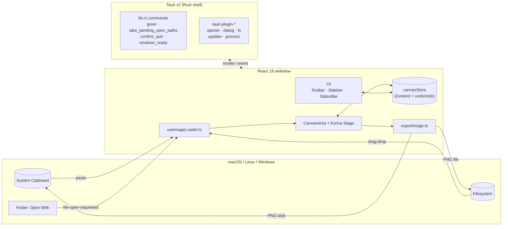
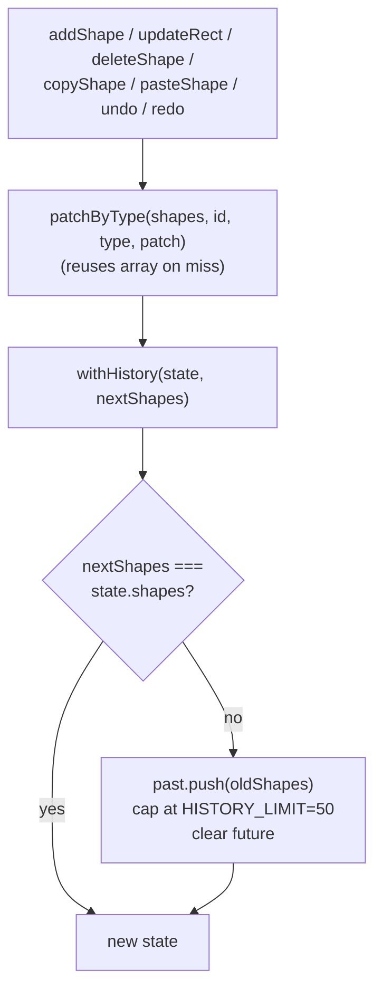
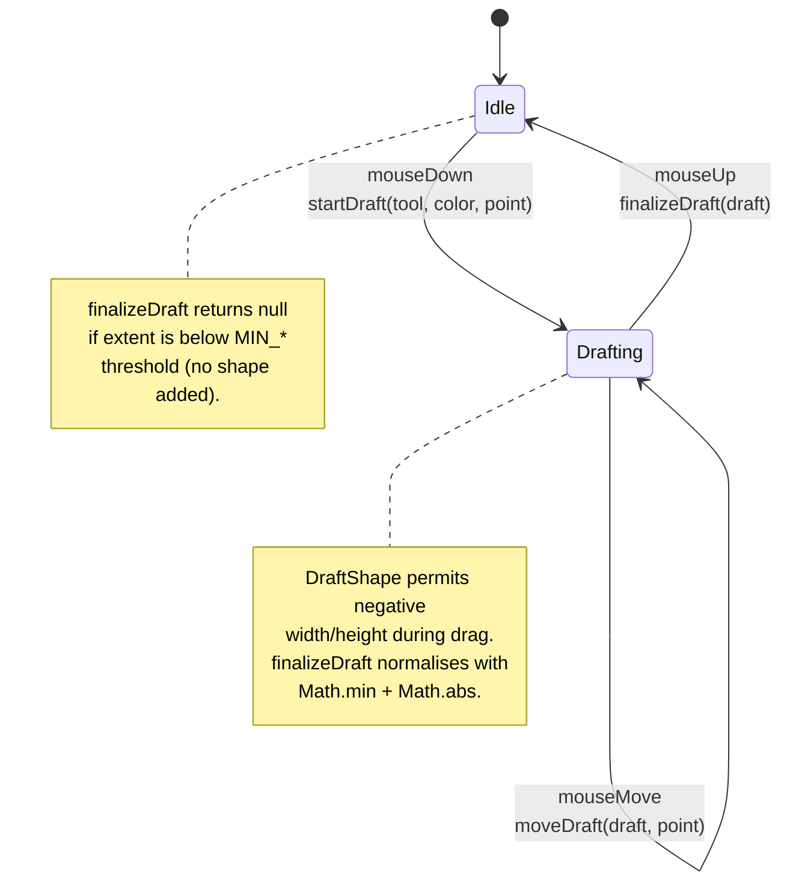
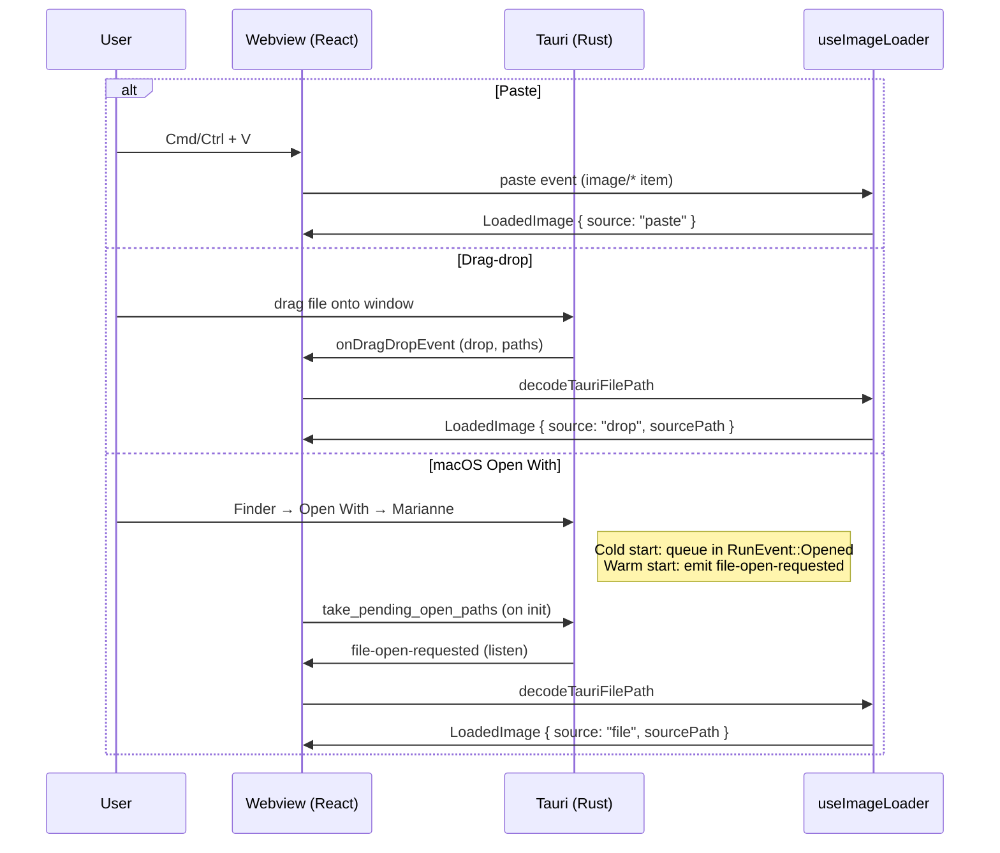
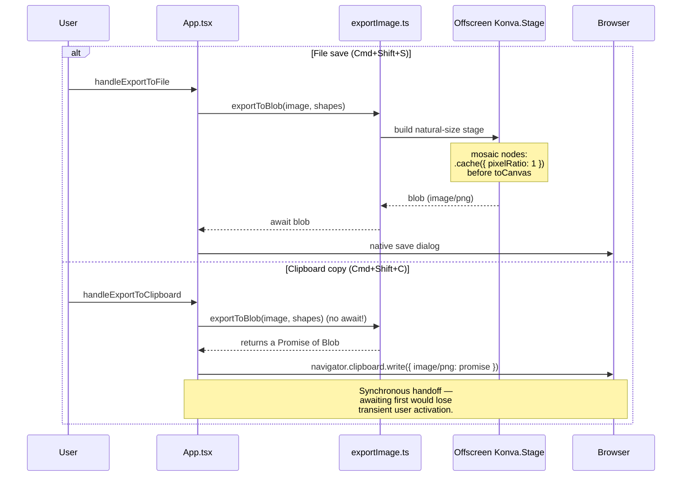

import { Aside } from "@astrojs/starlight/components";

`marianne` is a Tauri v2 desktop app with a React 19 + react-konva web frontend. The Rust shell is intentionally minimal; almost all annotation logic lives in `src/`.

## System overview

## Coordinate-space invariant

<Aside type="caution" title="Read this first">
All `Shape` coordinates in `canvasStore` are stored in the image's **natural
pixel space** (origin at the image top-left, max at `naturalWidth /
naturalHeight`). Screen-space conversion happens only at rendering and pointer
boundaries.
</Aside>

The conversion helpers live in [`src/lib/imageFit.ts`](https://github.com/takecy/marianne/blob/main/src/lib/imageFit.ts):

- `fitContain(image, container)` → display rect of a letter-boxed image (screen px `FitRect`)
- `imageToScreen` / `screenToImage` — bidirectional conversion
- `imageToScreenScale` — returns `scaleX` / `scaleY` for stroke widths, font sizes, and mosaic pixel sizes
- `clampToImage` — clamps pointer-derived coords into the image bounds

When you add a new shape type or pointer interaction, **never persist screen coordinates**. Convert at the mouse handler / `onTransformEnd` boundary and store natural coords. After each transform, reset `node.scaleX(1); node.scaleY(1)` so Konva's temporary scale doesn't leak into the next render.

## State management — Zustand with identity-preserving history

`src/store/canvasStore.ts` is the single source of truth for shapes, selection, undo/redo, and the in-app shape clipboard:

Behaviour:

1. If `nextShapes === state.shapes` (reference-equal), the old state is returned unchanged. `patchByType` reuses the original array on misses, so a no-op `updateXxx()` does not pollute history.
2. Otherwise the old `shapes` is pushed onto `past`, capped at `HISTORY_LIMIT = 50`, and `future` is cleared.

`undo` / `redo` both clear `selectedShapeId` to prevent the Transformer from grabbing a stale node.

## Drawing gesture state machine

`src/lib/drawingGesture.ts` is a **pure module** (no React, no Konva imports). `CanvasArea.handleMouseDown/Move/Up` drives it:

This module has its own unit tests and must never import React.

## Image input — three paths

`src/lib/useImageLoader.ts` is the **only** entry point for images. There is no file-open dialog.

Path validation (extension whitelist, symlink rejection) is the Rust side's trust boundary. Frontend's `isImagePath` is defense-in-depth.

## Export pipeline

Two paths share the same offscreen Konva stage built from the image's natural size:

<Aside type="danger" title="Do not refactor the clipboard path to async/await">
WebKit/WKWebView requires `navigator.clipboard.write` to start synchronously
inside a user-gesture handler. Awaiting the blob first loses the transient
activation token and the write silently fails inside the Tauri webview.
</Aside>

## Mosaic — the most delicate part

- **Screen rendering** ([`MosaicNode.tsx`](https://github.com/takecy/marianne/blob/main/src/components/MosaicNode.tsx)): a `Konva.Image` with `crop` in natural pixels, `filters: [Pixelate]`, and `pixelSize = MOSAIC_NATURAL_PIXEL_SIZE * min(imgScaleX, imgScaleY)`. The `useEffect` that calls `.cache()` must list **every** prop that affects the cached canvas in its deps — miss one and the pixelation freezes on a stale frame.
- **Export** (`src/lib/exportImage.ts`): both `stage.toCanvas({ pixelRatio: 1 })` and the prior `.cache({ pixelRatio: 1 })` are required. Omitting either makes Retina (DPR=2) double the cache canvas, so blocks look half-size in the exported PNG.

`MOSAIC_NATURAL_PIXEL_SIZE = 24` is defined in `MosaicNode.tsx` and imported by both screen and export. Treat it as fixed for backward compatibility.
