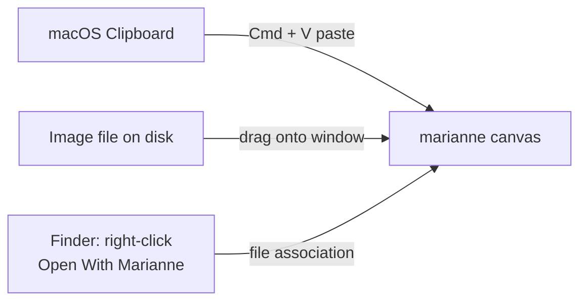

import { Aside } from "@astrojs/starlight/components";

marianne has **no file-open dialog** by design. Images enter the canvas through exactly three paths — pick whichever fits your workflow.

## The three input paths

### 1. Paste from clipboard

Press **`Cmd / Ctrl + V`** while marianne has focus. The first `image/*` item on the clipboard is decoded and placed on the canvas. This is the fastest path after a screenshot:

1. Take a screenshot to clipboard (on macOS: `Cmd + Shift + Ctrl + 4`).
2. Switch to marianne.
3. Press `Cmd + V`.

The status bar shows `pasted from clipboard` so you can verify the source.

### 2. Drag and drop

Drag any image file onto the marianne window. The first `image/*` file in the drop is decoded; other files are ignored. Useful when you want to annotate something already saved to disk without switching to Finder for "Open With".

The status bar shows the full file path on the left side, which doubles as the default save location later.

### 3. macOS "Open With Marianne"

In Finder, right-click an image file → **Open With → Marianne**. Two scenarios are handled:

- **Cold start** (marianne is not running): macOS launches the app and hands it the path. marianne queues the path and consumes it once the canvas is ready.
- **Warm start** (marianne is already running): the running instance receives the file path event and immediately loads the image.

Either way the file path appears in the status bar.

<Aside type="tip" title="Set Marianne as the default image opener">
Right-click an image → **Get Info** → **Open with: Marianne** → **Change All**
to make Marianne the default opener for that file type. After that, double-
clicking an image in Finder opens it directly in Marianne.
</Aside>

## Replacing the current image

Loading a new image while annotations exist on the canvas prompts a confirmation. Choose **Replace** to swap (and lose the previous annotations) or **Cancel** to keep working on the current image.

<Aside type="caution" title="Annotation history is per-image">
Undo / redo history resets when you load a new image. You cannot undo back to
the previous image's annotations after replacement.
</Aside>

## What about other formats?

marianne accepts the formats the system / browser layer can decode — typically **PNG, JPEG, GIF, WebP, BMP**. PDF, SVG, and HEIC are not supported; convert to PNG or JPEG first.
