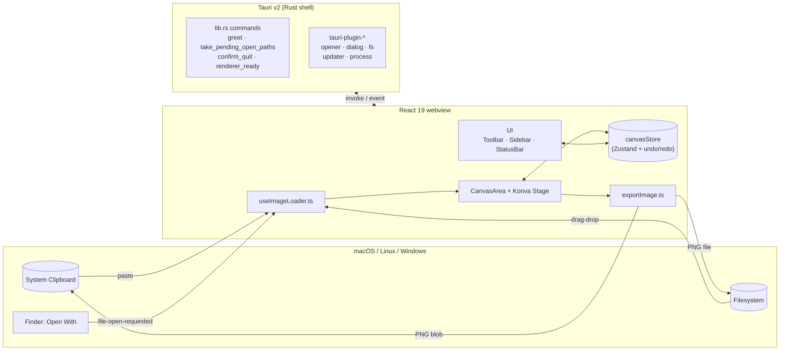
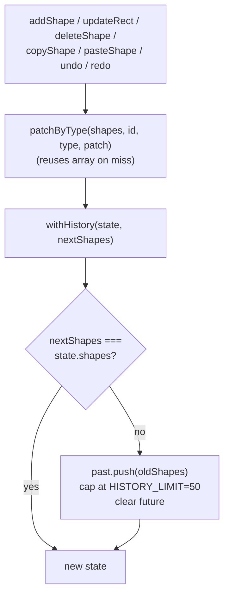
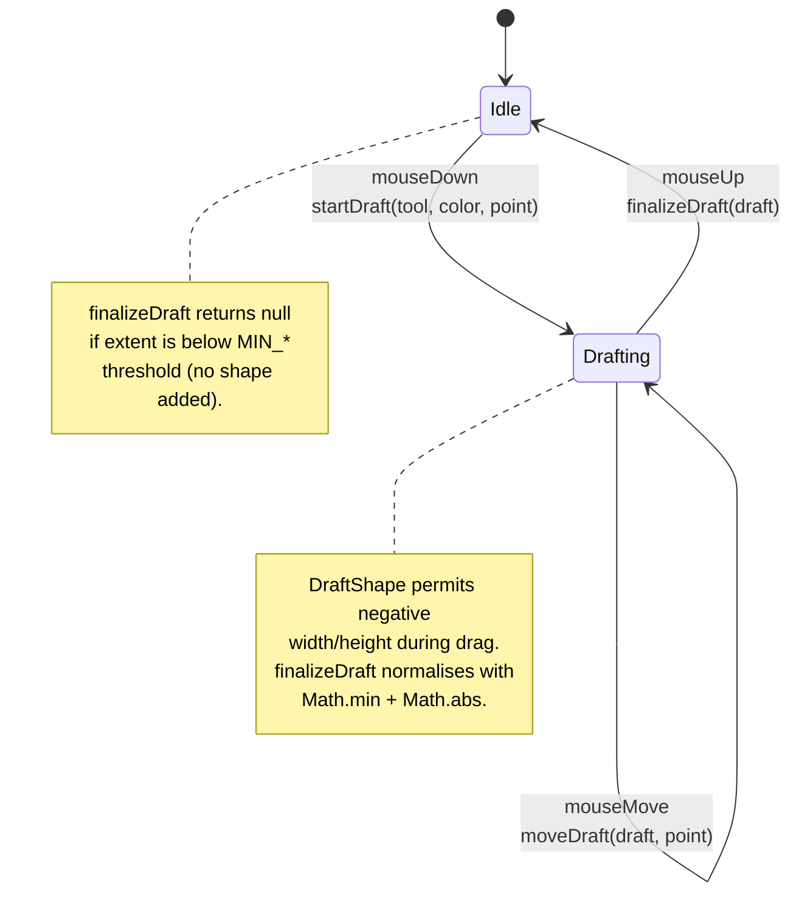
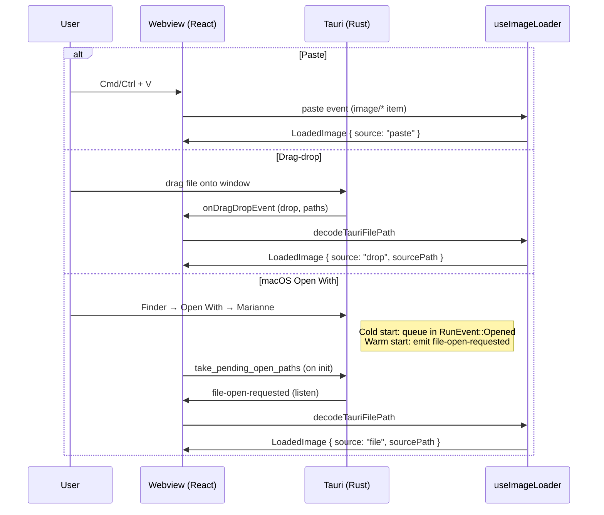
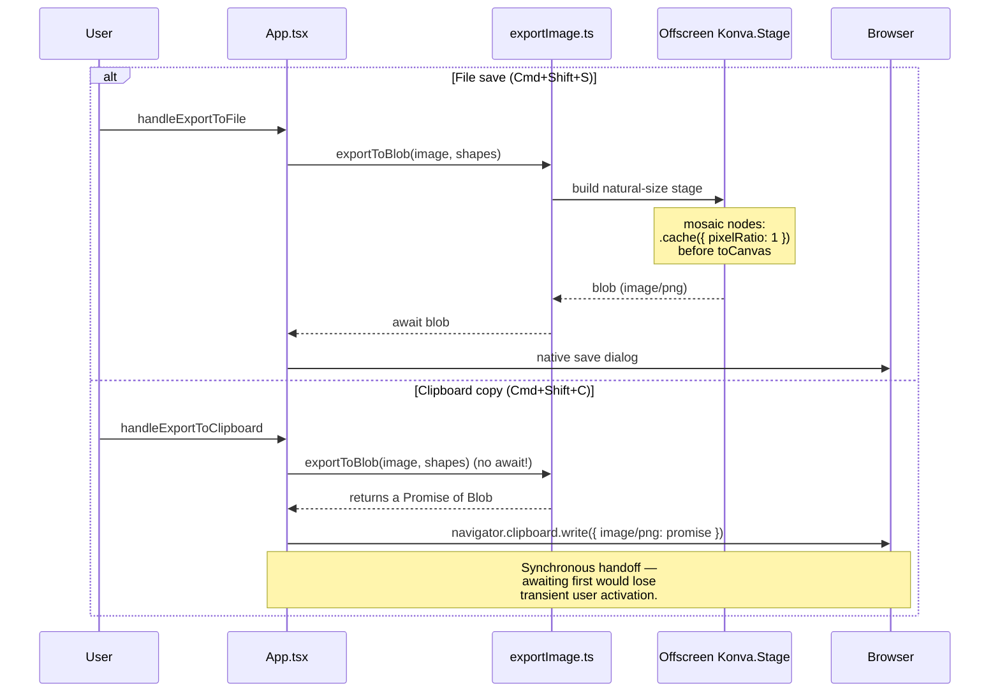

import { Aside } from "@astrojs/starlight/components";

**Marianne** は Tauri v2 デスクトップアプリで、React 19 + react-konva の Web フロントエンドを内包する。Rust シェルは意図的に最小化されており、アノテーションロジックのほぼ全ては `src/` 配下に存在する。

## システム全体図

## 座標系の不変条件

<Aside type="caution" title="最初に読むこと">
`canvasStore` に保存される `Shape` の座標はすべて画像の**自然ピクセル空間**
(画像左上が原点、最大値は `naturalWidth / naturalHeight`)。screen 座標との
変換は描画境界・ポインタ境界でのみ行う。
</Aside>

変換ヘルパーは [`src/lib/imageFit.ts`](https://github.com/takecy/marianne/blob/main/src/lib/imageFit.ts) に集約されている:

- `fitContain(image, container)` → 画像をレターボックス配置した表示矩形 (screen px の `FitRect`)
- `imageToScreen` / `screenToImage` — 双方向変換
- `imageToScreenScale` — ストローク幅・フォントサイズ・モザイクピクセルサイズ用の `scaleX` / `scaleY`
- `clampToImage` — ポインタ由来の座標を画像内にクランプ

新しいシェイプ型やポインタ操作を追加するときに、**screen 座標を永続化してはならない**。マウスハンドラや `onTransformEnd` の入口で変換し、natural 座標を保存する。各 transform 終了後に `node.scaleX(1); node.scaleY(1)` でリセットしている理由は、Konva の一時的な scale が次のレンダーへリークしないようにするため。

## 状態管理 — Zustand + identity-preserving な履歴

`src/store/canvasStore.ts` がシェイプ・選択・undo/redo・アプリ内シェイプクリップボードの単一の真実ソース:

挙動:

1. `nextShapes === state.shapes` (参照等価) なら旧 state を返す。`patchByType` はマッチ無時に元配列を再利用するため、ヒットしない `updateXxx()` 呼び出しが履歴を汚すのを防ぐ。
2. それ以外なら旧 `shapes` を `past` に push し、`HISTORY_LIMIT = 50` でキャップ、`future` をクリアする。

`undo` / `redo` は `selectedShapeId` をクリアする (Transformer が古いノードに掴みかかるのを防ぐため)。

## 描画ジェスチャーのステートマシン

`src/lib/drawingGesture.ts` は **純粋モジュール** (React / Konva 非依存)。`CanvasArea.handleMouseDown/Move/Up` がこれを駆動する:

このモジュールは独自の単体テストを持つ。React を import してはいけない。

## 画像入力 — 3 つの経路

`src/lib/useImageLoader.ts` が画像入力の **唯一** の entry point。ファイルオープンダイアログは存在しない。

パス検証 (拡張子 whitelist、symlink 拒否) は Rust 側の trust boundary。フロントの `isImagePath` は defense-in-depth。

## エクスポートパイプライン

2 つの経路が、画像の自然サイズで構築された同じオフスクリーン Konva stage を共有する:

<Aside type="danger" title="クリップボード経路を async/await にリファクタしないこと">
WebKit/WKWebView では `navigator.clipboard.write` をユーザージェスチャー
ハンドラ内で同期的に開始する必要がある。先に blob を await すると transient
activation トークンを失い、Tauri webview 上でクリップボード書き込みが無言で
失敗する。
</Aside>

## モザイク — パイプラインで最も繊細な部分

- **画面表示** ([`MosaicNode.tsx`](https://github.com/takecy/marianne/blob/main/src/components/MosaicNode.tsx)): natural ピクセル矩形を `crop` として持つ `Konva.Image` に `filters: [Pixelate]` を適用し、`pixelSize = MOSAIC_NATURAL_PIXEL_SIZE * min(imgScaleX, imgScaleY)` を設定。`useEffect` 内で `cache()` を呼ぶが、その deps にはキャッシュキャンバスに影響する全 prop を含めること。1 つでも漏らすとピクセル化が古いまま固まる。
- **エクスポート** (`src/lib/exportImage.ts`): `stage.toCanvas({ pixelRatio: 1 })` と直前の `.cache({ pixelRatio: 1 })` の両方が必須。指定しないと Retina (DPR=2) でキャッシュキャンバスが 2 倍化し、PNG 上でブロックサイズが小さく見えてしまう。

`MOSAIC_NATURAL_PIXEL_SIZE = 24` は `MosaicNode.tsx` で定義され、画面側・エクスポート側の双方で import される。後方互換のため固定運用する。
