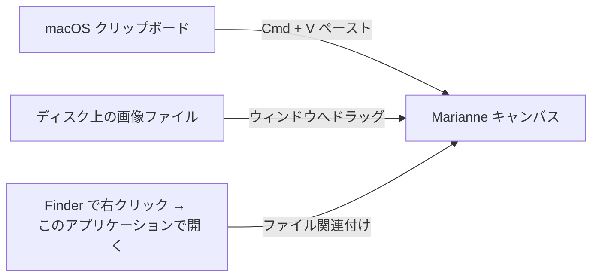

import { Aside } from "@astrojs/starlight/components";

Marianne には設計上 **ファイルオープンダイアログが存在しない**。画像は以下の 3 経路のいずれかでキャンバスに入る — ワークフローに合うものを選ぼう。

## 3 つの取り込み経路

### 1. クリップボードからペースト

Marianne にフォーカスがある状態で **`Cmd / Ctrl + V`** を押す。クリップボード上の最初の `image/*` アイテムがデコードされてキャンバスに配置される。スクリーンショット直後の最速ルート:

1. スクリーンショットをクリップボードに撮る (macOS: `Cmd + Shift + Ctrl + 4`)。
2. Marianne に切り替える。
3. `Cmd + V` を押す。

ステータスバーには `pasted from clipboard` と表示され、ソースを確認できる。

### 2. ドラッグ&ドロップ

任意の画像ファイルを Marianne ウィンドウへドラッグする。ドロップに含まれる最初の `image/*` ファイルがデコードされ、他のファイルは無視される。Finder で「このアプリケーションで開く」を経由したくない場合の手早い経路。

ステータスバー左側にフルファイルパスが表示され、後の保存時のデフォルトディレクトリとしても使われる。

### 3. macOS の「このアプリケーションで開く」

Finder で画像ファイルを右クリック → **このアプリケーションで開く → Marianne**。2 つのシナリオに対応:

- **コールドスタート** (Marianne 未起動): macOS がアプリを起動し、パスを渡す。Marianne はパスをキューに入れ、キャンバスが準備できたら取り出す。
- **ウォームスタート** (Marianne 起動中): 起動中インスタンスがファイルパスイベントを受け取り、即座に画像を読み込む。

どちらの場合もファイルパスがステータスバーに表示される。

<Aside type="tip" title="Marianne をデフォルトの画像オープナーに設定する">
画像を右クリック → **情報を見る** → **このアプリケーションで開く: Marianne** →
**すべてを変更...** で、その種類のファイルのデフォルトオープナーを Marianne に
できる。以降、Finder で画像をダブルクリックすれば直接 Marianne で開く。
</Aside>

## 画像の差し替え

キャンバス上に注釈がある状態で別画像を読み込もうとすると、確認ダイアログが出る。**差し替え** を選ぶと前画像の注釈は失われる。**キャンセル** を選ぶと現在の画像で作業を続けられる。

<Aside type="caution" title="注釈履歴は画像単位">
新しい画像を読み込むと undo / redo の履歴はリセットされる。差し替え後に
前画像の注釈に undo で戻ることはできない。
</Aside>

## 対応する画像フォーマット

Marianne はシステム / ブラウザ層がデコードできるフォーマットを受け入れる — 通常は **PNG, JPEG, GIF, WebP, BMP**。PDF, SVG, HEIC は非対応 — 事前に PNG / JPEG へ変換すること。
